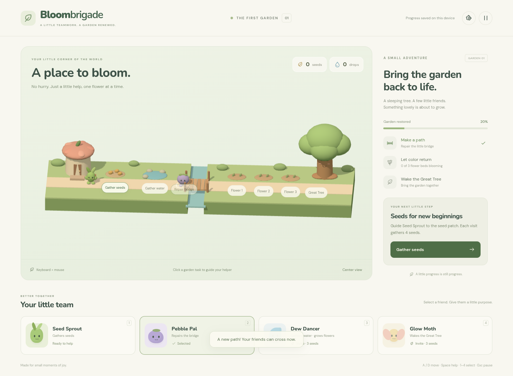
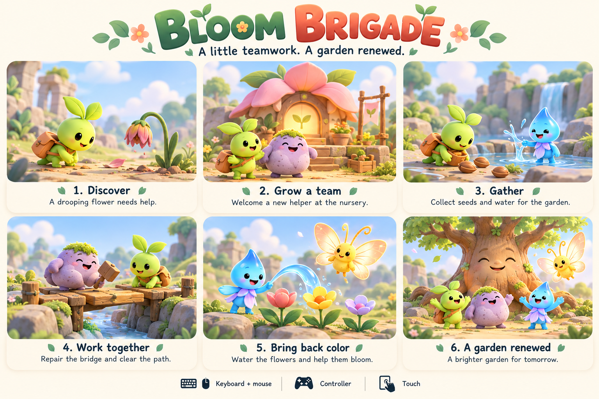

# Bloom Brigade

An original, kid-friendly, peaceful 3D strategy MVP for web, with iOS and Android packaging configuration.

Players gather seeds and water, grow a team of garden helpers, repair paths, and restore a sleeping garden. Colorful stylized 3D characters inhabit a side-view world with depth.



## Play locally

Use Node.js 22.12+ (Node.js 24 recommended).

```sh
npm ci
npm run dev
```

Open the address printed by Vite in your browser. In the restricted cloud machine, use `npm --cache /tmp/bloom-npm-cache ci` if the default npm cache is not writable.

Gather resources, invite four original helpers, repair a bridge, grow three flower beds, and awaken the Great Tree. The next-step button guides the tutorial; you can also select helpers and assign tasks yourself. There is no combat, countdown, advertising, account, or purchase flow. Progress and settings are stored on the current device only.

## Controls

| Input | Controls |
| --- | --- |
| Keyboard / mouse | Click helpers and tasks; A/D or arrows move; Space interacts nearby; Enter takes the guided next step; 1–4 selects or invites; Q/E pans; Escape pauses |
| Controller | Standard-mapped gamepad: left stick moves; A interacts nearby; X takes the next step; bumpers cycle helpers; D-pad cycles task targets; Y assigns target; right stick pans; Start pauses; Back opens settings |
| Touch | Tap helpers and tasks; on-screen arrows move; Help interacts nearby |

Settings include movement/interaction key remapping, reduced motion, and optional gentle sound effects. Controller D-pad navigation and A/B confirmation work in dialogs. Keyboard-only users can also Tab through all buttons. Controller availability depends on browser, OS, and device compatibility; physical hardware validation is outstanding.

## Build and validate

```sh
npm test
npm run build
npm run test:e2e
```

Browser tests use `/usr/bin/chromium` when available. Otherwise run `npx playwright install chromium`, or set `PLAYWRIGHT_CHROMIUM_EXECUTABLE_PATH` to a compatible local Chromium binary. The cloud network currently blocks the Playwright browser download domain; this instance uses its installed Chromium.

The production output is `dist/`. Serve that folder on an HTTPS static host. Assets use relative paths, so subdirectory hosting is supported. No backend or runtime secrets are needed. The game requires WebGL and a modern browser; hardware performance and Safari testing remain to be done.

## Mobile packaging

```sh
npm run mobile:android
npm run mobile:ios
```

These repeatable commands build the web game, create the requested Capacitor project if absent, and sync assets. Generated `android/` and `ios/` projects are ignored; regenerate them from the committed config. If native-specific customization is introduced later, track the native source before relying on it.

Open Android with `npx cap open android` on a machine with Android Studio and its required SDK/JDK. Open iOS with `npx cap open ios` on macOS with Xcode. `com.bloombrigade.game` is a provisional application ID; choose your final unique identifier before creating signing credentials or store listings. Native project generation and asset sync do not establish successful device builds or store readiness.

## Design



See the [design brief](docs/design-brief.md) for gameplay, visual direction, controls, and the proposed first milestone.

The playable version uses Three.js, Vite, and original procedural 3D models. See [MVP scope and release checks](docs/mvp.md) for the implementation and outstanding work.
